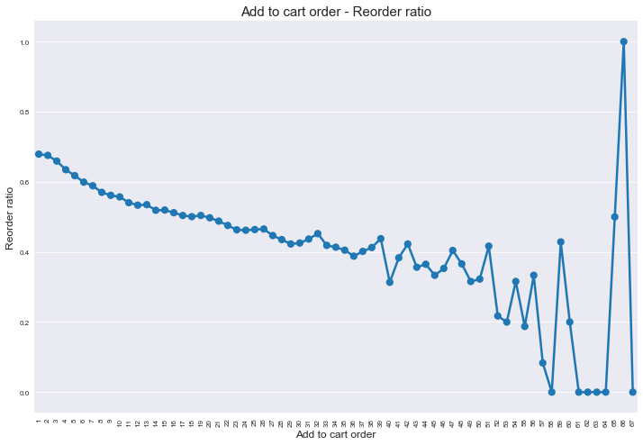

### Task - Exploratory Data Analysis

#### Aim

Exploratory Data Analysis is intended to generate insights for subsequent
analysis.

As such, its aims are more diffuse. For the Instacart set, much of its purpose
is to create new dataframes by joining the existing tables and looking at
typical data, its cardinality, etc.

#### Detail

Kieran has created a [notebook](Assignment_2_-Setup.ipynb) that shows how to
create your own slices of data from the Instacart data set. It includes
settings like `MAX_PRODUCTS` and `MAX_USERS`, so that is is possible to select
a slice that is specific to you and which is sized appropriately for your
laptop.

Regarding EDA, the Python notebooks that Kieran provided for the Week 8 (ARM)
Practicals provide an excellent basis for your own explorations. In particular,
[Practical C](https://kmurphy.bitbucket.io/modules/Data_Mining/topics/08-Association_Analysis/13-Practical_C_-_ARM_Instacart_Dataset/files/Practical_C_-_ARM_Instacart_Dataset.ipynb)
and parts of Practicals A and B should be used as a starting point for your own
investigations.

For the classification task, Kieran has also studied reorder rate as a function
of "order added to cart", see .

We recommend that you recreate his analysis and use linear regression to derive
the relationship between reorder rate and the order in which products are added
to each cart, as this represents a feature that might prove helpful when
predicting the product mix of the next order (which is the subject of the
Classification task).

In the Assignment Setup notebook, Kieran has also added a list of 21 possible
explorations, and a mechanism to generate a random sample of 5 of them. We
recommend that you perform those 5 explorations _as a minimum_.  It is always a
good principle to explore your data even if you have specific questions to
answer.  In that way, you are better placed to interpret the outputs of your
analyses elsewhere (and, in this case, to get more marks there!). One feature
of such explorations is that you are focused on getting a feel for the data
rather than fitting a model. You should tackle the 5 relevant explorations, and
any others that interest you, either from that list or your own curiosity.

